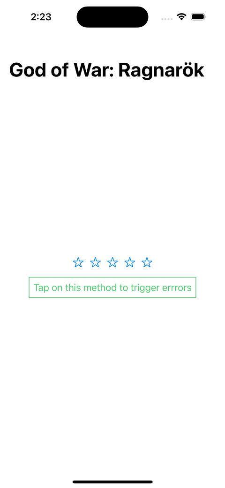

# Feedback-Sample

Sample code from [Feedback component](https://swiftunwrap.com/article/how-create-feedback-component/) built on [swiftunwrap.com](https://swiftunwrap.com).

The sample show the feedback component in action when user performs an action.

# Usage

Download the repository, open, build and run the project. That's all.

If you want to look how the feedback is implemented, look to the code in [Components](FeedbackSample/Components/).

If you want to *understand* how the code work, read the article on [SwiftUnwrap]((https://swiftunwrap.com/article/how-create-feedback-component/)).

